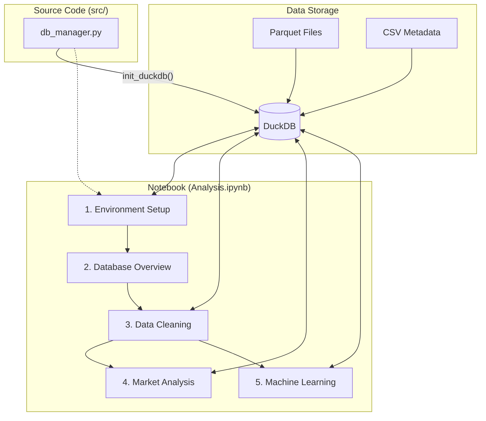

# NYC Taxi Project: Architecture & Code Flow

This document describes the structure and data flow of the project. The primary analysis is conducted in `Analysis.ipynb`, while `Draft/Data.ipynb` serves as a historical reference.

## 1. Project Structure

```text
.
├── Analysis.ipynb          # [MAIN] Primary analysis environment
├── Draft/
│   └── Data.ipynb          # [REF] Historical draft and data cleaning reference
├── src/
│   ├── db_manager.py       # Centralized DuckDB connection management
│   └── taxi_data.duckdb    # Analytical database
├── Dataset/
│   ├── DIM/                # Dimension tables (CSV/Parquet)
│   └── (Parquet files)     # Raw NYC Taxi data (ignored by git)
├── .agents/
│   └── rules/              # Agent behavior and project rules
└── Data_model.md           # Documentation of the Star Schema
```

## 2. System Architecture

The project uses a modular architecture combining high-performance data engines with interactive visualization.



## 3. Detailed Execution Flow (Analysis.ipynb)

### Phase 1: Initialization & Standardization
1. **Connection**: Connects to `src/taxi_data.duckdb`.
2. **View Creation**: Dynamically creates DuckDB Views for Yellow, Green, FHV, and HVFHS datasets across different periods (Pre-2019, 2019-2025, 2026+).
3. **Cleaning & Modeling**: Standardizes taxi types and constructs a **Hybrid Multi-Fact Schema**. This creates 4 independent virtual Fact Views (`v_FACT_YELLOW_TRIPS`, etc.) for specialized analysis, and 1 unified `v_MARKET_OVERVIEW` for aggregate reporting.

### Phase 2: Exploratory Data Analysis (EDA)
- **Market Growth**: Calculates MoM and YoY growth rates, including Mean and Median metrics.
- **Market Share**: Analyzes competition between Yellow Taxi and HVFHS (Uber/Lyft).
- **Financial Trends**: Tracks fares, tips, and revenue distribution.

### Phase 3: Predictive Modeling
- **Forecasting**: Uses **Prophet** for time-series projection.
- **Anomaly Detection**: Uses **Isolation Forest** for warning systems.

## 4. Key Libraries Used
- **DuckDB**: Fast SQL engine for billion-row datasets.
- **Pandas**: Data manipulation and statistical summaries.
- **Plotly**: Interactive visualizations.
- **Prophet**: Time-series forecasting.
- **Scikit-learn**: Machine Learning (Anomaly Detection).
