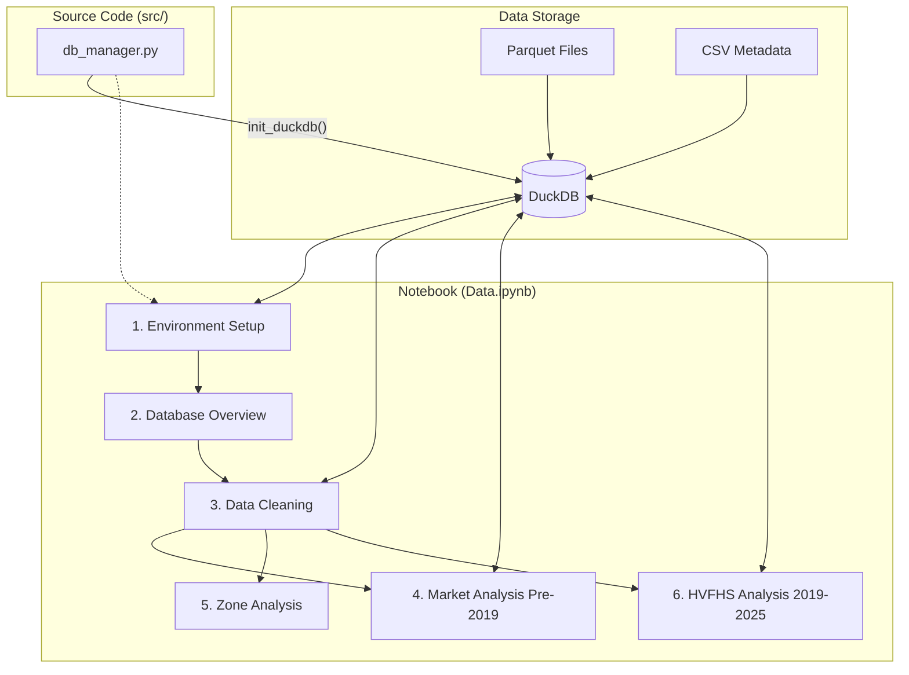

# NYC Taxi Project: Data.ipynb Code Flow & Architecture

This document describes the structure and data flow of the `Data.ipynb` notebook, which serves as the primary analysis environment for the NYC Taxi dataset.

## 1. System Architecture

The project uses a modular architecture combining high-performance data engines with interactive visualization.

## 2. Detailed Execution Flow

### Phase 1: Initialization & Standardization
1. **Connection**: Connects to `src/taxi_data.duckdb`.
2. **View Creation**: Dynamically creates DuckDB Views for Yellow, Green, FHV, and FHVHV datasets across different periods (Pre-2019, 2019-2025, 2026+).
3. **Cleaning**: Standardizes different taxi types into a unified format (`_cleaned` views) with consistent column names (`pickup_datetime`, `PULocationID`, etc.).

### Phase 2: Exploratory Data Analysis (EDA)
- **Market Growth (1.1.A & 1.2)**: 
    - Calculates Month-over-Month (MoM) growth rates.
    - Aggregates **Mean** and **Median** growth to understand market volatility.
    - Compares Year-over-Year (YOY) performance.
- **Market Share**:
    - Analyzes the "2017 Shift" where FHV (Uber/Lyft) began to dominate.
    - Uses Pie charts to show share evolution.
- **Financial Trends (HVFHS)**:
    - Calculates Total Revenue, Mean Fare, and Median Fare per year.
    - Tracks Average Fare and Tipping trends for Uber vs. Lyft.

## 3. Data Dictionary (Processed)

| Column | Description |
| :--- | :--- |
| `pickup_datetime` | Unified timestamp for trip start. |
| `dropoff_datetime` | Unified timestamp for trip end. |
| `PULocationID` | Pickup Taxi Zone ID (1-265). |
| `DOLocationID` | Dropoff Taxi Zone ID (1-265). |
| `trip_count` | Aggregated number of trips. |
| `market_share_pct` | Percentage of total market trips. |
| `growth_pct` | Month-over-month growth rate. |

## 4. Key Libraries Used
- **DuckDB**: Fast SQL engine for billion-row datasets.
- **Pandas**: Data manipulation and statistical summaries.
- **Plotly**: Interactive visualizations (Bar, Pie, Line charts).
- **Matplotlib/Seaborn**: Static plotting (where applicable).
