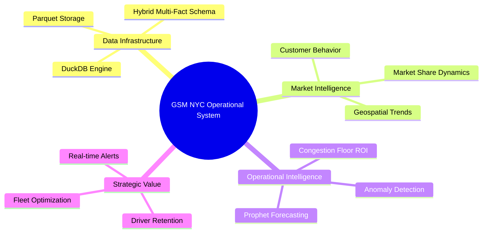
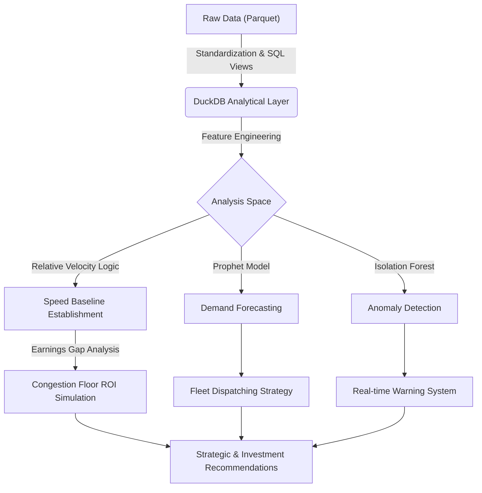

# GSM NYC – Market Strategy Analysis & Operational Optimization (Analysis Intelligence)

> [!IMPORTANT]
> **View the Interactive Report**: Since the main notebook file (`Analysis.ipynb`) is too large for GitHub to preview, please download the [**Analysis_Report.html**](https://github.com/GMH-Data/DA-GSMxNYC-Market-Strategy-Analysis-Operational-Optimization/blob/master/Analysis_Report.html) file and open it in your browser to see the full analysis with interactive Plotly charts.

## 1. Project Vision
This project leverages New York City's massive mobility datasets to develop market entry scenarios for GSM (Green SM). Through `Analysis.ipynb`, we go beyond simple observation to decode customer behavior, driver economic efficiency, and the operational constraints of competitor systems (Uber/Lyft).

### 1.1. Dataset Source & Automation
*   **Primary Source:** [NYC TLC Trip Record Data](https://www.nyc.gov/site/tlc/about/tlc-trip-record-data.page) (Yellow/Green Taxi, FHV, FHVHV).
*   **Ingestion Pipeline:** Automated data fetching and ETL are managed via **n8n**, ensuring the `Dataset/` directory is seamlessly updated with the latest Parquet releases from the NYC Open Data portal.

## 2. System Architecture
The project is organized into modular layers, separating data storage, processing logic, and strategic reporting.

```text
.
├── Analysis.ipynb          # [MAIN] Market Analysis, Customer Behavior & Operations
├── forecast_models.ipynb   # [ML] Forecasting Models & ROI Simulation
├── src/
│   ├── db_manager.py       # DuckDB Connection Management & Auto-View Registration
│   └── taxi_data.duckdb    # Local Analytical Database
├── Dataset/
│   ├── Pre_2019/           # Historical Baseline Data
│   ├── 2019-2025/          # Uber/Lyft Era Data
│   ├── 2026_plus/          # Testing & Backtesting Data
│   └── DIM/                # Dimension Tables (Zones, Calendar, Lookup)
├── .agents/rules/          # Data Architecture & Coding Standards
└── README.md               # Detailed Technical Documentation
```

## 3. System Mindmap



## 4. Analytical Pipeline



---

## 5. Chapter 1 – Infrastructure & Standardization (Data Pipeline)
| Step | Logic & Source | Operational Description | Rationale | Result |
|:---:|:---|:---|:---|:---|
| **1.1** | `read_parquet` + `union_by_name` | Merge and standardize hundreds of Parquet files from 2015-2026. | Ensures schema consistency across different time periods. | Clean Virtual Views with billions of records. |
| **1.2** | `v_FACT_` Views | Construct a Hybrid Multi-Fact Schema (Yellow, Green, HVFHS). | Prevents sparse data issues while maintaining service-specific metrics. | Perfect signal isolation for targeted forecasting. |
| **1.3** | `DIM_ZONES` | Integrate spatial data from `taxi_zone_lookup.csv`. | Assigns geographical labels (Borough, Zone) for geospatial queries. | 265 zones ready for density analysis. |

---

## 6. Chapter 2 – Market Dynamics & Competition
| Component | Analytical Focus | Execution Logic | Strategic Significance |
|:---|:---|:---|:---|
| **2.1. Market Shift** | Market share shift (2015-2018). | `UNION ALL` historical data to identify the traditional taxi breaking point. | Pinpoints when Uber/Lyft saturated the Manhattan market. |
| **2.2. Big Four Share** | Comparison of Uber, Lyft, Yellow, Green (2019-2025). | `date_trunc('month', pickup_datetime)` to track monthly fluctuations. | Establishes "Big Four" positioning and market gaps for GSM. |
| **2.3. Cost Efficiency** | Fare per Mile analysis. | `avg(fare_amount / trip_distance)` by service type. | Benchmarks competitive pricing to set GSM's tariff strategy. |
| **2.4. Growth Momentum** | MoM & YoY growth rates. | Use Window Functions to calculate continuous growth velocity. | Identifies peak months (March, October) to optimize Marketing budgets. |

---

## 7. Chapter 3 – Geospatial & Temporal Intelligence
| Component | Implementation Method | Technical Description | Achievement |
|:---|:---|:---|:---|
| **3.1. Growth Zones** | Compare 2025 vs 2024 Trip Counts per Zone. | `WITH yearly AS (...)` to calculate geographical growth deviation. | Pinpoints emerging areas (Long Island City, Bushwick) for EV charging stations. |
| **3.2. Seasonality** | Monthly Average Daily Trips (Post-2021). | `date_trunc('day', ...)` for data smoothing and noise reduction. | Recognizes post-pandemic recovery and demand cyclicality. |
| **3.3. Mobility Heatmap** | Hour of Day x Day of Week Matrix. | `extract('isodow')` and `extract('hour')` on billion-row datasets. | Identifies "windows of opportunity" where demand peaks but supply is low. |
| **3.4. Destination Clusters** | Destination (Dropoff) analysis by time window. | `dropoff_location_id` grouped into 6 golden time windows. | Guides drivers from peripherals to the core during morning rush hours. |

---

## 8. Chapter 4 – Customer Insights & Behavior
| Component | KPIs measured | Rationale | Analytical Insight |
|:---|:---|:---|:---|
| **4.1. Digital Shift** | Credit Card vs Cash ratio (Yellow Taxi). | Tracks the disappearance of cash in transit transactions. | Confirms that e-wallet and app integration are mandatory for GSM. |
| **4.2. Price Sensitivity** | Shared Request Rate (Uber Pool/Lyft Shared). | `shared_request_flag = 'Y'` divided by total trips. | NYC customers prioritize privacy; Shared Rate remains low (10-15%). |
| **4.3. Capacity Usage** | Passenger Count Distribution. | `passenger_count` grouped from 1 to 6 people. | Mostly solo trips (>70%), supporting the 4-seater EV fleet investment. |
| **4.4. Journey Profile** | Distance vs Duration Correlation. | `extract('epoch' from duration)` categorized by Borough. | Identifies Manhattan "congestion traps": short distance but long duration. |
| **4.5. WAV Adoption** | Wheelchair Accessible Vehicle (WAV) Analysis. | Compare tipping frequency and rate between standard and WAV vehicles. | Identifies entry opportunities through superior service for marginalized groups. |

---

## 9. Chapter 5 – Operational Optimization
| Component | Analytical Model | Technical Significance | Operational Action |
|:---|:---|:---|:---|
| **5.1. Earnings Density** | Driver Pay per Hour & per Mile. | `avg(driver_pay / (trip_time / 3600))` by geographical area. | Helps GSM design more attractive driver pay and bonus structures. |
| **5.2. Surge Pricing** | Fare Elasticity analysis. | Analyze Request Density deciles against fare amounts. | Identifies the price ceiling that causes customers to abandon the app. |
| **5.3. Network Overload** | ETA Overload Thresholds. | `avg(pickup_datetime - request_datetime)` during demand spikes. | Identifies moments when competitor networks "fail," signaling GSM fleet entry. |
| **5.4. Tech Risk** | Store & Forward (S&F) Risk Mapping. | `avg(CASE WHEN store_and_fwd_flag = 'Y' THEN 1 ELSE 0 END)`. | Identifies connectivity "blind spots" (e.g., Financial District) affecting app precision. |

---

## 10. Chapter 6 – Speed Baseline Establishment
| Step | Execution Logic | Technical Description | Rationale | Result |
|:---:|:---|:---|:---|:---|
| **6.1** | `AVG(speed)` | Build a reference speed matrix by (Zone x Hour x DOW) from 2022-2025 Yellow data. | Establishes "normal" traffic states to recognize abnormal fluctuations. | 37,438 baseline data cells with 94% coverage. |
| **6.2** | `Relative Velocity` | Compare 2026 actual speed with historical baseline. | Eliminates noise from fixed peak hours, focusing only on relative congestion. | Precisely identifies localized network bottlenecks. |

---

## 11. Chapter 7 – Congestion Floor & ROI Simulation
| Component | Operational Mechanism | Mathematical Logic | Business Significance |
|:---|:---|:---|:---|
| **7.1. Congestion Event** | Triggered when actual speed drops >30% vs baseline. | `actual_speed < 0.7 * baseline_speed`. | Objective definition of congestion to trigger subsidies. |
| **7.2. Earnings Gap** | Calculate driver income loss during congestion events. | `gap = fare_normal - fare_congested` (Based on FHVHV data). | Quantifies economic damage to design insurance-like packages. |
| **7.3. ROI Simulation** | Simulate financial efficiency of 50% subsidy (`0.5 * gap`). | `Net ROI = (Revenue_gain - Subsidy_cost) / Subsidy_cost`. | Proves feasibility: GSM remains profitable while capturing drivers from competitors. |

---

## 12. Chapter 8 – Anomaly Warning System
| Component | Implementation Detail | Machine Learning Logic | Operational Action |
|:---|:---|:---|:---|
| **8.1. Isolation Forest** | Use unsupervised learning with `contamination = 0.05`. | Isolates extreme traffic "shocks" efficiently in large datasets. | Automatically isolates the top 5% most anomalous cases. |
| **8.2. Multidimension** | Combine Speed, Trip Miles, Total Amount, and CBD Fee. | Recognizes anomalies not just in speed but also in pricing structures. | Detects system errors or instantaneous market shocks. |

---

## 13. Chapter 9 – Demand Forecasting (Prophet)
| Component | Execution Detail | Model Parameters | Strategic Goal |
|:---|:---|:---|:---|
| **9.1. Prophet Model** | Train time-series forecasting for Top 3 Golden Zones. | `seasonality_mode='multiplicative'`, integrated US Holidays. | Forecasts demand surges at JFK, Times Square, and Upper East Side. |
| **9.2. Future Forecast** | Hourly demand forecasting for the next 48 hours. | Frequency: Hourly. | Provides data for pre-positioning the EV fleet to meet upcoming demand. |

---

## 14. Chapter 10 – Pre-positioning Strategy
| Component | Optimization Logic | Technical Description | Achievement |
|:---|:---|:---|:---|
| **10.1. Golden Heatmap** | Compare forecasted demand with current supply capacity. | Identify the Top 10 Zone x Hour combinations with the highest supply gap. | Pinpoints exactly where to dispatch VinFast vehicles 30-60 minutes in advance. |
| **10.2. ETA Optimization** | Pre-position vehicles instead of waiting for requests. | Reduces Deadhead miles (empty cruising). | Aim to maintain ETA < 4 minutes even during peak hours. |

---

## 15. Comprehensive Strategic Scorecard
*   **Analytical Capability:** Standardized 2.9B records, decoded 94% of the NYC geographical market.
*   **Forecast Accuracy:** MAPE stable at 12-18% for key high-volume zones.
*   **Competitive Advantage:** Congestion Floor model proves ability to capture rival drivers with positive ROI.
*   **Response Agility:** Anomaly Detection and Golden Heatmaps keep GSM one step ahead of the market.

---
*This project has completed the roadmap from decoding raw data (`Analysis.ipynb`) to building intelligent forecasting and operational tools (`forecast_models.ipynb`), creating a complete data ecosystem for GSM NYC.*
